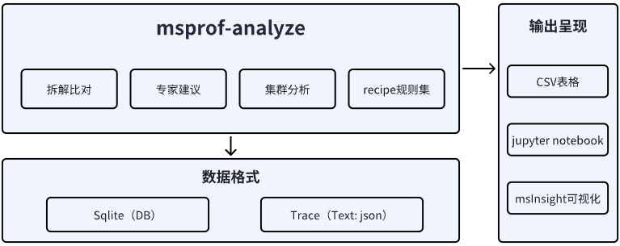
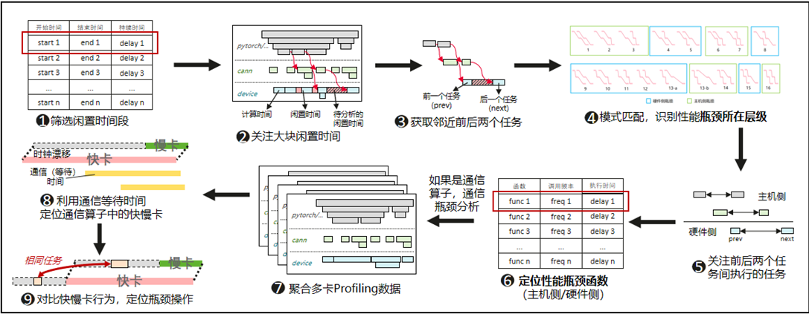
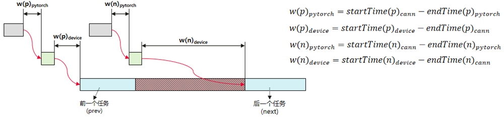
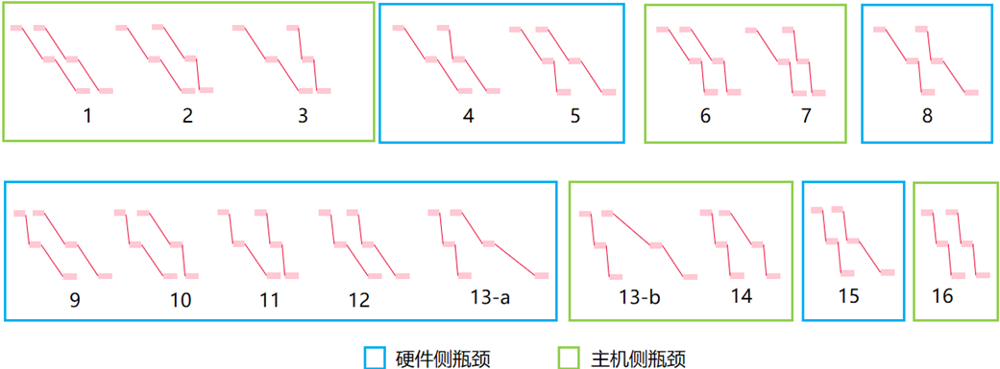
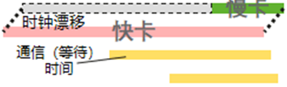
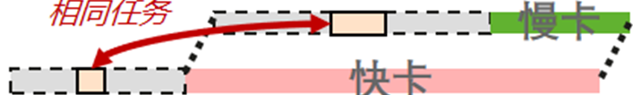

# MindStudio Profiler Analyze Feature Analysis and Design Specifications

|                                           |                   |
| ----------------------------------------- | ----------------- |
| SIG group:                                | mstt-sig          |
| Incorporated into the following versions: | MindStudio 26.0.0 |
| Designer:                                 | chenhao           |
| Date:                                     | 2026.01. 21       |

**Copyright © 2022 openGauss Community**

Your reproduction, use, modification and distribution of this document is subject to the Creative Commons Attribution-ShareAlike 4.0 International Public License ("CC BY-SA 4.0"). For ease of understanding, you can visithttps://creativecommons.org/licenses/by-sa/4.0/Understand the overview (but not the replacement) of CC BY-SA 4.0. You can obtain the complete CC BY-SA 4.0 agreement from the following website: https://creativecommons.org/licenses/by-sa/4.0/legalcode.

**Revision records**

| Date        | Revised version | Revision Description | Authors | Audited |
| ----------- | --------------- | -------------------- | ------- | ------- |
| 2026.01. 21 | 1.0             | Completed the draft. | chenhao | chenhao |

# 1. Feature Overview

This product analyzes and processes performance data, including basic modules such as performance disassembly and comparison, expert suggestions, and cluster analysis, and identifies service performance bottlenecks.

## 1.1 Scope

## 1.2 Feature Requirement List

Table 1 List of feature requirements

| Requirement No. | Requirement name                          | Feature Description                                                             | Remarks |
| --------------- | ----------------------------------------- | ------------------------------------------------------------------------------- | ------- |
| 1               | Model performance analysis and comparison | Analysis Report on the Disassembly and Comparison Capability of Model Operators |         |
| 2               | Host analysis                             | Automatic identification of host Bound performance problems                     |         |

# 2. Requirement Scenario Analysis

## 2.1 Feature Requirement Source and Value Overview

1. Model unpacking performance disassembly and optimization direction. Automatic disassembly and comparison capabilities are required to improve performance optimization and analysis efficiency.

2. Automatically identifies and analyzes host Bound problems, and quickly demarcates bottlenecks in big models and cluster scenarios.

## 2.2 Feature Scenario Analysis

Model-based unpacking and baseline version performance improvement direction.

## 2.3 Feature Impact Analysis

*This section describes the position and peripheral interfaces of the feature in the entire system. Describe the key constraints or feature conflicts of the feature.*

Interaction analysis with other requirements and features: only data analysis is involved and the module is disassembled independently.

Platform Difference Analysis: Windows/Linux

Compatibility analysis: No compatibility issue is found after the new module capability is added.

Constraints and restrictions: None

### 2.3.1 Hardware Limitations

| Product Type                                | Support |
| ------------------------------------------- | ------- |
| Atlas A3 Series Training/Inference Products | support |
| Atlas A2 Series Training/Inference Products | support |

### 2.3.2 Technical Limitations

Operating system: Linux

Programming language: C/Python

### 2.3.3 Impact Analysis on the License

NA

### 2.3.4 Impact Analysis on System Performance Specifications

Resources are allocated on demand. No specific specifications are required.

### 2.3.5 Impact Analysis on System Reliability Specifications

NA

### 2.3.6 Impact on System Compatibility

This feature is a new feature of the data analysis module and has no impact on compatibility.

### 2.3.7 Impact Analysis on Interaction and Conflicts with Other Key Features

NA

## 2.4 Analysis on the Implementation Solution of Similar Community/Commercial Software

NA

# 3. Feature/Function implementation principles (multiple use cases can be broken down)

## 3.1 Objectives

## 3.2 Overall Solution

MindStudio Profiler Analyze (msprof-analyze) is a performance analysis tool developed by MindStudio throughout the entire process. It analyzes collected performance data and identifies performance bottlenecks in AI jobs.

    

Figure 2: Overall msprof-analyze solution

# 4. Data analysis supports disassembly and comparison and automatic host Bound analysis and identification

## 4.1 Design Idea

Identify the pattern modeling of adjacent tasks based on idle time in the cluster and communication domain, locate performance bottlenecks, and automatically identify and improve automation efficiency.

## 4.2 Constraints 

NA

## 4.3 Detailed implementation (module-level or process-level message sequence diagram from user entry)

    

Figure 3: Host Bound identification process

The implementation details are as follows:

1. First, calculate and filter the idle time of the NPU hardware, and focus on a large block of idle time.
2. For a large block of idle time, determine the performance bottleneck level and classify the performance bottleneck level as the host side bottleneck. Classify the device layer problem as the device side bottleneck.
    
    1. Pay attention to the two hardware tasks that are adjacent to the idle time of the current large block, and the CANN layer delivery operation on the host side and the PyTorch layer delivery task.
    2. Calculate the inter-layer waiting time based on the host-side delivery and hardware-side execution behaviors of two neighboring hardware tasks.
        
            
    3. Based on the interlayer waiting time of neighboring tasks, the current behavior pattern is constructed.
        
            
3. For the bottleneck on the host side,we pay attention to all the Pytorch and CANN layer tasks that occur between the neighboring tasks,and give the Pytorch and CANN layer functions that take the longest time.
4. For hardware bottlenecks, focus on all device-side tasks executed between neighboring tasks. For the tasks between the two periods, consider the delay and frequency of these operations comprehensively, calculate the comprehensive delay, and select the operation with the largest comprehensive delay as the performance bottleneck operation.
5. If the current performance bottleneck is identified as a communication operator task, perform multi-card association analysis on the communication task.
    
    1. Aggregate the communication execution time of all cards in the communication domain of the communication operator task, find the fastest card and the slowest card, that is, find the card with the longest and shortest waiting time of the communication task, and align the communication task end time of the fast and slow cards, so as to adjust the clock drift between the cards
        
            
    2. Focus on the tasks of the slow card during the fast card waiting period, find the corresponding tasks between the slow card and the fast card, compare the delay differences between the same tasks, and select the operation task with the largest delay difference as the bottleneck operation of the slow card.
        
            

## 4.4 Interfaces Between Subsystems (Mainly Covering the Definition of Module Interfaces)

*In this section, you only need to describe the .h interface involved in the modification and briefly describe the modification.*

## 4.5 Subsystem LLD

See 4.3.

## 4.6 DFX Attribute Design

### 4.6.1 Performance Design

The analysis capability of the new module, data comparison and identification of some compute nodes, and the impact on performance are controllable.

### 4.6.2 Upgrade and Capacity Expansion Design

NA

### 4.6.3 Exception Handling Design

NA

### 4.6.4 Resource Management Design

NA

### 4.6.5 Miniaturized Design

NA

### 4.6.6 Testability Design

NA

### 4.6.7 Security Design

#### 4.6.7.1 Safety Design Qualification

*Check the security design by referring to the security design checklist.*

| Security attributes                | Check Item                                                                                                                                                   | Check Item Description                                                                                                                                                                                                                                                                                                                                                                                                                                                                                                                                                                                                                                                                                                                                                                                                                                                                                                                                                                                                                                                             | Involved or Not | Satisfied or not |
| ---------------------------------- | ------------------------------------------------------------------------------------------------------------------------------------------------------------ | ---------------------------------------------------------------------------------------------------------------------------------------------------------------------------------------------------------------------------------------------------------------------------------------------------------------------------------------------------------------------------------------------------------------------------------------------------------------------------------------------------------------------------------------------------------------------------------------------------------------------------------------------------------------------------------------------------------------------------------------------------------------------------------------------------------------------------------------------------------------------------------------------------------------------------------------------------------------------------------------------------------------------------------------------------------------------------------- | --------------- | ---------------- |
| Access channel control             | Whether to add a listening port                                                                                                                              | The communication matrix needs to be updated for new listening ports.                                                                                                                                                                                                                                                                                                                                                                                                                                                                                                                                                                                                                                                                                                                                                                                                                                                                                                                                                                                                              | No.             |                  |
| Access channel control             | Whether to add new processes or communication between components                                                                                             | Added the communication matrix between new processes or components.                                                                                                                                                                                                                                                                                                                                                                                                                                                                                                                                                                                                                                                                                                                                                                                                                                                                                                                                                                                                                | No.             |                  |
| Access channel control             | Whether to add an authentication mode                                                                                                                        | The communication matrix and product documentation must be updated for the new authentication mode.                                                                                                                                                                                                                                                                                                                                                                                                                                                                                                                                                                                                                                                                                                                                                                                                                                                                                                                                                                                | No.             |                  |
| Permission control                 | Whether to create a file or directory                                                                                                                        | To create a file or directory, you must explicitly specify the access permission for the file or directory.                                                                                                                                                                                                                                                                                                                                                                                                                                                                                                                                                                                                                                                                                                                                                                                                                                                                                                                                                                        | Yes             | Yes              |
| Permission control                 | Check whether the account permission meets the "minimum permission principle".                                                                               | All accounts in the system must be assigned with the least permission.                                                                                                                                                                                                                                                                                                                                                                                                                                                                                                                                                                                                                                                                                                                                                                                                                                                                                                                                                                                                             | No.             |                  |
| Permission control                 | Check whether user privilege escalation exists.                                                                                                              | Unauthorized user privilege escalation is prohibited.                                                                                                                                                                                                                                                                                                                                                                                                                                                                                                                                                                                                                                                                                                                                                                                                                                                                                                                                                                                                                              | No.             |                  |
| Undisclosed Interface              | Whether to add GUC parameters                                                                                                                                | The product documentation needs to be updated when GUC parameters are added.                                                                                                                                                                                                                                                                                                                                                                                                                                                                                                                                                                                                                                                                                                                                                                                                                                                                                                                                                                                                       | No.             |                  |
| Undisclosed Interface              | Add or modify functions, views, and system tables.                                                                                                           | When adding or modifying functions, views, and system tables, the product documentation must be updated and permission control must be considered.                                                                                                                                                                                                                                                                                                                                                                                                                                                                                                                                                                                                                                                                                                                                                                                                                                                                                                                                 | Yes             | Yes              |
| Undisclosed Interface              | Add SQL Syntax                                                                                                                                               | The new SQL syntax needs to be updated in the product documentation to support recording audit logs.                                                                                                                                                                                                                                                                                                                                                                                                                                                                                                                                                                                                                                                                                                                                                                                                                                                                                                                                                                               | No.             |                  |
| Undisclosed Interface              | Whether to add internal tools                                                                                                                                | Product documentation needs to be updated for new internal tools.                                                                                                                                                                                                                                                                                                                                                                                                                                                                                                                                                                                                                                                                                                                                                                                                                                                                                                                                                                                                                  | Yes             | Yes              |
| Undisclosed Interface              | Check whether the script contains comment code.                                                                                                              | Do not comment out code in explanatory languages such as Shell and Python. The comment code needs to be deleted.                                                                                                                                                                                                                                                                                                                                                                                                                                                                                                                                                                                                                                                                                                                                                                                                                                                                                                                                                                   | No.             |                  |
| Undisclosed Interface              | Check whether there are access modes such as hidden commands, parameters, and ports.                                                                         | Access modes, such as commands, parameters, and ports, that are not used during maintenance on the live network (including but not limited to product production, commissioning, and maintenance purposes), must be deleted (e.g. by compiling macros)                                                                                                                                                                                                                                                                                                                                                                                                                                                                                                                                                                                                                                                                                                                                                                                                                             | No.             |                  |
| Undisclosed Interface              | Check whether the system has hidden backdoors.                                                                                                               | Do not reserve any undisclosed accounts in the system. All accounts must be managed by the system and must be described in the documentation.                                                                                                                                                                                                                                                                                                                                                                                                                                                                                                                                                                                                                                                                                                                                                                                                                                                                                                                                      | No.             |                  |
| Undisclosed Interface              | It is prohibited to provide cracking and network sniffing tools in the software (including software packages and patch packages) released to external users. | 1. It is prohibited to provide the software (including software packages and patch packages) released to external users that can change any user password or have the "password cracking capability". (Brute force cracking of passwords and malicious cracking of passwords by exploiting system/algorithm vulnerabilities) 2. Functions or tools used to decrypt files that contain sensitive data (such as configuration files and databases that contain keys). 2. Do not retain third-party network sniffing tools, such as tcpdump, gdb, strace, readelf, and process debugging tools, in the system. CPP, GCC, dexdump, mirror, JDK development/compilation tools, and self-developed debugging tools/scripts used only in the commissioning phase (for example, encryption and decryption scripts, commissioning functions, and commands that can be used only in the commissioning phase), which must be retained due to service requirements, and strict access control is required. In addition, describe the reason, application scenario, and risk for the retention. | No.             |                  |
| Sensitive data protection          | Authentication credentials cannot be stored in the system in plaintext and must be encrypted.                                                                | Authentication credentials (such as passwords and private keys) must be encrypted and cannot be stored in the system in plaintext.                                                                                                                                                                                                                                                                                                                                                                                                                                                                                                                                                                                                                                                                                                                                                                                                                                                                                                                                                 | No.             |                  |
| Sensitive data protection          | The key used for encrypting sensitive data transmission cannot be hard-coded.                                                                                | Hard coding of passwords and keys is prohibited.                                                                                                                                                                                                                                                                                                                                                                                                                                                                                                                                                                                                                                                                                                                                                                                                                                                                                                                                                                                                                                   | No.             |                  |
| Sensitive data protection          | Check whether sensitive information, such as passwords and keys, is printed in plaintext.                                                                    | Do not display sensitive information (passwords, private keys, and pre-shared keys) in plaintext in logs, debugging information, error messages, and ps commands stored in the system.                                                                                                                                                                                                                                                                                                                                                                                                                                                                                                                                                                                                                                                                                                                                                                                                                                                                                             | No.             |                  |
| Sensitive data protection          | Specifies whether to display the password in plaintext.                                                                                                      | Do not display passwords in plaintext.                                                                                                                                                                                                                                                                                                                                                                                                                                                                                                                                                                                                                                                                                                                                                                                                                                                                                                                                                                                                                                             | No.             |                  |
| Sensitive data protection          | Whether the default passwords of third-party and open-source software are used                                                                               | Do not use the default passwords of third-party and open-source software. For details, see section 1.5 in the Security Design Guide.                                                                                                                                                                                                                                                                                                                                                                                                                                                                                                                                                                                                                                                                                                                                                                                                                                                                                                                                               | No.             |                  |
| Sensitive data protection          | Indicates whether to store passwords in plaintext in configuration files.                                                                                    | Plaintext passwords cannot be written into configuration files. (except the scenario where the password must be configured during the installation, deployment, and use of the command-line tool.)                                                                                                                                                                                                                                                                                                                                                                                                                                                                                                                                                                                                                                                                                                                                                                                                                                                                                 | No.             |                  |
| Sensitive data protection          | Whether to use insecure encryption algorithms                                                                                                                | Do not use proprietary or insecure encryption algorithms. Recommended Encryption Algorithm Security Design Guide.                                                                                                                                                                                                                                                                                                                                                                                                                                                                                                                                                                                                                                                                                                                                                                                                                                                                                                                                                                  | No.             |                  |
| Sensitive data protection          | Check whether sensitive information, such as passwords, is transmitted over secure channels.                                                                 | Sensitive information must be transmitted between untrusted networks through secure transmission channels or encrypted transmission. For details, see chapter 10 of the Security Design Guide.                                                                                                                                                                                                                                                                                                                                                                                                                                                                                                                                                                                                                                                                                                                                                                                                                                                                                     | No.             |                  |
| Sensitive data protection          | Check whether sensitive information such as passwords and keys in the memory is destroyed after being used.                                                  | The passwords or keys in the memory are cleared immediately after being used.                                                                                                                                                                                                                                                                                                                                                                                                                                                                                                                                                                                                                                                                                                                                                                                                                                                                                                                                                                                                      | No.             |                  |
| Sensitive data protection          | The random number used in the cryptographic algorithm must be the cryptographic secure random number.                                                        | The random number used in the cryptographic algorithm must be the cryptographic secure random number. For details, see section 6.3 in the Security Design Guide.                                                                                                                                                                                                                                                                                                                                                                                                                                                                                                                                                                                                                                                                                                                                                                                                                                                                                                                   | No.             |                  |
| Sensitive data protection          | Whether there are insecure examples in the documentation                                                                                                     | The examples in the documentation must be secure and provide correct guidance for users. If the examples contain potential risks, describe the risks in the documentation.                                                                                                                                                                                                                                                                                                                                                                                                                                                                                                                                                                                                                                                                                                                                                                                                                                                                                                         | No.             |                  |
| Certification                      | Provide authentication mechanism                                                                                                                             | The new system needs to provide the authentication mechanism and the authentication mechanism is enabled by default.                                                                                                                                                                                                                                                                                                                                                                                                                                                                                                                                                                                                                                                                                                                                                                                                                                                                                                                                                               | No.             |                  |
| Certification                      | Indicates whether authentication is performed on the server.                                                                                                 | The authentication process needs to be performed on the server.                                                                                                                                                                                                                                                                                                                                                                                                                                                                                                                                                                                                                                                                                                                                                                                                                                                                                                                                                                                                                    | No.             |                  |
| Certified                          | Indicates whether the server returns valid information after the authentication fails.                                                                       | After the authentication fails, the information returned by the server does not provide detailed information that can be used to locate the error cause.                                                                                                                                                                                                                                                                                                                                                                                                                                                                                                                                                                                                                                                                                                                                                                                                                                                                                                                           | No.             |                  |
| External parameter verification    | Indicates whether to verify the validity of external input.                                                                                                  | 1. If external input data is used as the loop termination condition, array subscript, and memory allocation parameter, infinite loop, buffer overflow, memory overwriting, and DoS may occur. 2. Verify the validity of external input, such as file paths, to prevent injection risks.                                                                                                                                                                                                                                                                                                                                                                                                                                                                                                                                                                                                                                                                                                                                                                                            | No.             |                  |
| Third-party component introduction | Third-party components are introduced.                                                                                                                       | 1. New third-party components must be scanned by using secure compilation options, viruses, vulnerabilities, open source fragment reference, license compliance, and open source components. For details, see the version release cyber security quality requirements. 2. The source of the new third-party components must be trusted.                                                                                                                                                                                                                                                                                                                                                                                                                                                                                                                                                                                                                                                                                                                                            | No.             |                  |

#### 4.6.7.2 Sensitive Data Analysis

##### 1. Sensitive data list

*The specific scope of sensitive data depends on the specific application scenario of the system. Designers need to analyze and determine the sensitive data based on risks. Typical sensitive data includes authentication credentials (such as passwords) and keys.*

| **Data field**                 | **Remarks/Descriptions**                           | **Data Field Sensitivity** | **Association processing module** | **Forced action**                                            | **Prohibited operations** |
| ------------------------------ | -------------------------------------------------- | -------------------------- | --------------------------------- | ------------------------------------------------------------ | ------------------------- |
| Administrator Account/Password | User name and password of the system administrator | High                       | Login/Authentication              | Encrypted transmission, encrypted storage, and anonymization | Output and logs           |
| ...                            | ...                                                | ...                        | ...                               | ...                                                          | ...                       |
|                                |                                                    |                            |                                   |                                                              |                           |

##### 2. Check sensitive operations

*1) Lifecycle dimension: For sensitive data identified, we need to identify the lifecycle of the data and identify the process of generation, use, transmission, persistence, and destruction to avoid unintentional omissions in the subsequent risk identification process. 2) High-risk handling process Identify whether sensitive data is handled with high risks. Typical high-risk processing includes printing, echoing, storage, hard coding, and insecure algorithms. From the perspective of information processing, these high-risk processes are prone to security vulnerabilities when sensitive data is processed. Therefore, the sensitive data needs to be checked in detail. The sensitive data check matrix is as follows:*

For example, in a typical web system, the following table lists the check results of sensitive data (administrator accounts and passwords) in the lifecycle.

 * Generated: The administrator sets the password when logging in to the system for the first time.
 * Usage: The administrator uses the password for authentication when logging in to the system.
 * Transmission: After the administrator enters the login password on the client, the password is transmitted to the server through the network.
 * Persistence: After the administrator sets a password for the first time, the server persists the password in the backend database.
 * Destroy: After a specified period, the administrator is forced to change the password and delete the old password.

|                    |                                                               Produced                                                               |                         Use the                          |                                                        Transmission                                                        |                Persistence                |                                       Destroy                                        |
|:------------------:|:------------------------------------------------------------------------------------------------------------------------------------:|:--------------------------------------------------------:|:--------------------------------------------------------------------------------------------------------------------------:|:-----------------------------------------:|:------------------------------------------------------------------------------------:|
|       Print        |                                                            Not involved.                                                             | The password will not be printed in any form during use. | No encryption is required in the secure transmission channel. Encrypted Transmission over Non-secure Transmission Channels |               Not involved.               | The password is not printed during the destruction, but operation logs are recorded. |
|       Output       |                 The ciphertext password is displayed on the client, and the password is displayed as \*\*\*\*\*\*\*.                 |                      Not involved.                       |                                                       Not involved.                                                        |               Not involved.               |                                    Not involved.                                     |
|       Stored       | After a user enters a password, the password is encrypted and saved to the backend database using the security encryption algorithm. |                         congener                         |                                                       Not involved.                                                        | Encrypted storage of the backend database |          Delete the corresponding password from the backend database table.          |
|     Hard-coded     |                                                            Not involved.                                                             |                      Not involved.                       |                                                       Not involved.                                                        |               Not involved.               |                                    Not involved.                                     |
| Insecure algorithm |                                            Encryption using the AES256 security algorithm                                            |              In-Memory Decryption When Used              |                             Non-secure transmission channels use secure encryption algorithms.                             |                 congener                  |                                    Not involved.                                     |

#### 4.6.7.3 Design Implementation

*Describe the overall security design solution, detailed implementation, and interface definition.*

## 4.7 External Interfaces of the System

NA

## 4.8 Self-Test Case Design

NA

# 5. Reliability and availability design

## 5.1 Redundancy Design

*The system adopts the redundancy design. The mirror backup, configuration parameter backup, and data synchronization between the active/standby redundant systems must be considered.*

*During feature design, provide the list of key configuration parameters for backup, data synchronization time and policies between active/standby redundancy systems, key data list, data check mechanism, dirty data processing policy, and backup and restoration policy during active/standby switchover.*

*For mirror backup, such as the snapshot/checkpoint mechanism, the backup period, data check mechanism, dirty data processing policy, and restoration policy must be provided. For features that have obvious impact on system performance, design constraints must be provided.*

## 5.2 Fault Management

*Fault management includes fault detection, fault isolation, fault locating, fault recovery, and correlation design.*

*Feature fault management includes fault detection, alarm/log design, fault recovery, and fault interface design.*

*Common design principles for fault management are as follows:*

1. *Comprehensive and rapid fault detection usually considers the detection scope, backup detection, detection speed, and detection impact.*
2. *To control the impact scope of a failure, consider the division of isolation domains such as multiple planes, multiple granularities, and isolation units.*
3. *Fast fault recovery usually takes into account the policies such as automatic recovery, priority recovery, hierarchical reset, uncoupled recovery, and hierarchical protection.*

*Common design modes for fault management include the RollBack mode, Fault Bypass mode, Circuit Breaker mode, and Isolation compartment mode.*

## 5.3 Overload control design

*The overload control design of the feature needs to consider the traffic detection, detection location, service drop location, response message information when a service is discarded, and invoking, invoking relationship, and interfaces between the feature and the unified overload control mechanism.*

*Rate limiting is usually used in the simple overload control mechanism of the feature. The location, default rate limit, and log alarms must be considered.*

*Common design principles of overload control include dynamic rate limiting, flexible scaling, load balancing before traffic control, early control, priority assurance, and elegant degrade design.*

1. *Early control: When the system is overloaded, control service access on the front end of the service process or the processing module that processes services earlier to avoid unnecessary performance consumption caused by intermediate control.*
2. *Priority guarantee: When the system is overloaded, services with higher priorities are preferentially allocated and processed, thus maximizing social benefits.*
3. *Elegant degrade design: degrade non-core services, bypass core functions, and experience degrade.*

## 5.4 Upgrade Without Service Interruption

Offline Python processing module script, which is not involved in service process running and does not involve terminal upgrade.

## 5.5 Human Error Design

*The human-caused errors of the feature are mainly prevented from man-machine interface errors such as commands, operations, configuration files, and data involved in the feature. The following aspects are usually considered:*

1. *High-risk messages and secondary confirmation must be provided for deletion and destructive modification. The default value of the page focus is Cancel. User-visible interfaces (including CLI and web pages) must be considered, including command interfaces provided by open-source components.*
2. *Check whether the node restart operation affects the running of the customer VM and provide a clear prompt for the restart operation.*
3. *All high-risk operations must be recorded in audit logs.*
4. *Prevent configuration errors, hardware misoperations, system check before operations, and quick rollback after operations are incorrect.*

*Common design principles for human error include:*

1. *Role constraint: The permission control design is used to prevent the configuration scope of different roles from being restricted, avoiding configuration errors caused by unauthorized configuration.*
2. *Configuration verification: The configuration validation mechanism is designed to ensure that necessary verification is performed before the configuration takes effect to prevent incorrect configurations from taking effect.*
3. *Backup and restoration: The backup and restoration design ensures that the configuration data can be quickly restored to the correct state when a configuration error occurs.*

## 5.6 Fault Prediction and Prevention Design

*This feature should cooperate with the system fault prediction and prevention capability to provide related data collection and statistics interfaces. For example, disk space detection.*

# 6. Design for features and non-functional quality attributes

## 6.1 Testability

*Describe the test direction and specifications of the feature, and describe the aspects that should be tested by the test personnel, and the boundary values, abnormal values, and abnormal scenarios that need to be noted.*

## 6.2 Serviceability

*Provides various maintainable and serviceable measures for features, and provides complete documentation for using, maintaining, and troubleshooting features.*

## 6.3 Evolvability

*Focus on the evolvability of the feature architecture and functions.*

## 6.4 Openness

*Focus on the openness of external interfaces, including the standardization of interfaces, for example, compliance with the SQL 2011 standard.*

## 6.5 Compatibility

*Focus on whether the feature affects the forward compatibility of the system, that is, whether the old functions are available after the upgrade and whether the usage behavior is consistent with that of the old version.*

## 6.6 Scalability/Scalability

*This feature effectively meets the requirements for system capacity changes, including scaling of database nodes and database servers.*

## 6.7 Maintainability

*Focus on feature maintainability, such as diagnosis view and log printing.*

## 6.8 Information

*Refer to the following table to evaluate the modification points of various documents involved in the feature and describe the specific modification points.*

| Category                                                                                                                                                                  | Manual Name           | Involved or Not (Y/N)                                      | Description of the modified or added content |
| ------------------------------------------------------------------------------------------------------------------------------------------------------------------------- | --------------------- | ---------------------------------------------------------- | -------------------------------------------- |
| White Paper                                                                                                                                                               | Technical white paper | N                                                          | Added the XX technology in section XX.       |
| Product Documentation                                                                                                                                                     | Product Description   | Y                                                          | Updated the technical specifications to XX.  |
| Feature Description                                                                                                                                                       | Y                     | Added the XX feature.                                      |                                              |
| Compilation Guide                                                                                                                                                         | Y                     | XXX                                                        |                                              |
| Installation guide                                                                                                                                                        | Y                     | Updated the XX scenario in section "Installing a Cluster." |                                              |
| Administrator's Guide                                                                                                                                                     | N                     | XXX                                                        |                                              |
| Developer guide (including the development tutorial, SQL reference, system tables and system views, GUC parameter description, error code description, and API reference) | Y                     | Added the XXX function in section XX.                      |                                              |
| Tool Reference                                                                                                                                                            | Y                     | Added the XX tool.                                         |                                              |
| Glossary of terms                                                                                                                                                         | Y                     | New term XX                                                |                                              |
| Getting Started                                                                                                                                                           | Easy tutorial         | N                                                          | XXX                                          |

# 7. (Optional) Data Structure Design

*This section describes how to design the database structure. (Database system table structure, which can be completed by using the Power Designer) (Optional)*
