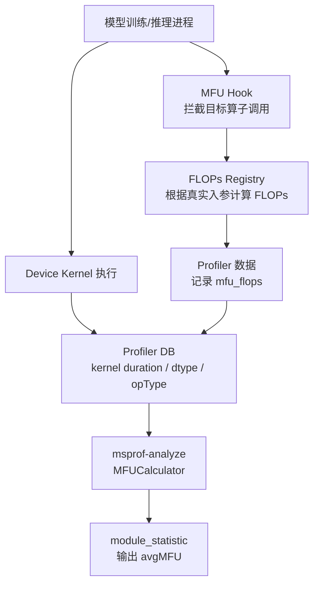

# MFU 采集与计算概要设计说明书

## 1. 背景与价值

### 1.1 MFU 定义

MFU（Model FLOPs Utilization，模型算力利用率）用于度量模型执行过程中实际计算量对芯片理论峰值算力的利用情况。在 msprof-analyze 的分析场景中，MFU 主要面向算子和 kernel 维度，用于回答“当前核心计算算子是否充分发挥了硬件算力”的问题。

MFU 的基本计算模型如下：

```text
MFU = FLOPs / Kernel执行耗时 / 芯片理论峰值算力
```

其中：

- `FLOPs` 表示算子本次执行对应的浮点或整数计算量。
- `Kernel执行耗时` 来自 Profiler 采集到的 device kernel 起止时间。
- `芯片理论峰值算力` 根据设备 AICore 数量、AIC 频率和数据类型峰值能力计算得到。

### 1.2 MFU 的分析价值

大模型训练和推理场景中，MatMul、Linear、Attention 等算子通常占据主要计算耗时。仅观察耗时占比只能说明“时间花在哪里”，但无法判断该算子是否真正高效使用了硬件计算能力。MFU 可以补充这一关键视角：

- 支撑计算瓶颈识别：区分“耗时高但算力利用充分”和“耗时高且算力利用不足”两类问题。
- 支撑算子优化判断：为算子实现、shape 排布、融合策略、推理服务配置优化提供量化依据。
- 支撑模型视图分析：在 module_statistic 中将 kernel 级 MFU 汇聚到模型结构层级，帮助用户定位到具体模块。
- 支撑跨场景对比：在不同模型、batch、seq length、推理框架配置下提供统一的算力利用率指标。

因此，MFU 能力不是单个算子的公式补充，而是性能分析工具中面向计算效率评估的基础能力。

### 1.3 算子级 MFU 的必要性

模型整体 MFU 可以反映端到端算力利用情况，但对于性能优化定位仍然不够精确。实际调优过程中，需要进一步回答：

1. 哪些模型模块贡献了主要计算耗时。
2. 哪些 device kernel 的算力利用率偏低。
3. 低 MFU 是算子公式、shape、数据类型、kernel 实现还是框架调度导致。
4. 新增 fused attention、推理专用算子后，分析工具能否持续跟进。

因此，本方案以算子级和 kernel 级 MFU 为基础，再通过 module_statistic 将结果向模型结构聚合，形成“kernel -> operator -> module”的分析闭环。

## 2. 需求与设计目标

### 2.1 功能需求

MFU 特性需要完成以下基础能力：

| 需求项 | 说明 |
|---|---|
| MFU 计算 | 对核心计算算子计算 FLOPs、执行耗时、理论峰值，并输出 MFU |
| 算子覆盖 | 支持 MatMul、Linear、FlashAttention 等大模型关键算子，并具备持续扩展能力 |
| 结果集成 | MFU 结果需要进入 module_statistic 分析结果，支撑模型结构维度展示 |
| 数据兼容 | 对已有 profiling 数据和原有 MFU 计算链路保持兼容 |

### 2.2 通用性目标

MFU 能力需要面向不同模型、不同框架接口和不同算子形态保持通用：

- 面向训练和推理场景，支持常规算子和融合算子。
- 面向不同 tensor layout，支持 shape、序列长度、稀疏模式等参数差异。
- 面向不同数据类型，支持按 dtype 映射对应芯片峰值能力。
- 面向不同 profiling 入口，尽量减少用户额外侵入式改造。

### 2.3 可扩展性目标

后续新增算子时，方案应满足低成本接入：

- FLOPs 公式与解析流程解耦，新增算子优先通过注册公式完成接入。
- 算子接入方式标准化，避免每新增一个算子都修改大量解析逻辑。
- 采集侧保留真实 Python 入参，便于处理动态 shape、layout、GQA/MQA 等运行时参数。
- 解析侧保持统一 MFU 计算模型，减少算子差异对结果汇聚的影响。

### 2.4 易用性与兼容性目标

已有 MFU 方案中，部分算子依赖用户手工 mstx 打点补齐参数。重构后应降低用户侧使用成本，并保证已有能力平滑演进：

- 对用户尽量体现为 profiler 开关能力，而不是分散的手工打点逻辑。
- 新方案有数据时优先使用新路径。
- 新方案数据缺失时，保留已有解析侧计算能力。
- module_statistic 输出形态保持稳定，避免影响用户已有使用习惯。

## 3. 现状分析与整体设计方案

### 3.1 已有 MFU 方案概述

当前 msprof-analyze 已具备一版 MFU 计算能力，整体逻辑是“解析侧反推 FLOPs”：

1. Profiler 采集 DB 数据，记录 kernel shape、dtype、执行时间等信息。
2. msprof-analyze 从 DB 中读取 kernel 信息。
3. 针对 MatMul、FlashAttention 等算子，由解析侧按策略公式计算 FLOPs。
4. 结合 kernel duration 和芯片峰值算力计算 MFU。
5. 将 kernel 级 MFU 汇聚到 module_statistic 结果中。


该方案已经形成了基本能力闭环，但其 FLOPs 获取依赖解析侧从 DB 反推。当算子需要运行时参数时，解析侧无法天然获取完整信息，需要额外打点补齐。

### 3.2 已有方案主要局限

已有方案的主要问题集中在通用性和扩展性：

| 问题 | 影响 |
|---|---|
| FLOPs 计算后置在解析侧 | 解析侧需要理解不同算子的 shape 字符串、layout 和特殊参数 |
| FlashAttention 依赖手工 `flash_attn_args` 打点 | 用户侧接入成本高，且容易出现漏打或错配 |
| 算子公式与 DB 解析强绑定 | 新增算子时需要同时关注公式、DB 字段、时间匹配和结果汇聚 |
| 运行时参数缺失 | 对 fused op、推理专用 attention、动态 shape 场景支持不足 |

因此，重构目标不是推翻已有 MFU 能力，而是在已有能力基础上，将 FLOPs 获取方式前移和标准化，提升 MFU 特性的可用性、通用性和演进效率。

### 3.3 方案设计思路

重构后的设计原则是：

```text
采集侧负责获得真实 FLOPs，解析侧负责统一计算和展示 MFU。
```

核心思路如下：

1. 在算子真实执行时，通过 hook 获取完整 tensor shape 和运行时参数。
2. 通过统一 FLOPs registry 查找算子公式，计算本次调用 FLOPs。
3. 通过 Profiler 可采集的数据通道记录 FLOPs。
4. msprof-analyze 解析阶段优先读取已记录 FLOPs。
5. 结合 kernel 执行耗时和芯片峰值算力，按统一公式计算 MFU。
6. 对没有新数据的 profiling 结果，继续兼容已有解析侧计算路径。

该设计将“算子差异”主要收敛在 FLOPs 公式注册层，将“MFU 计算和展示”保持在解析侧统一处理。

### 3.4 整体数据链路



链路中各类数据在 MFU 计算中的作用如下：

| 数据 | 获取方式 | 用途 |
|---|---|---|
| FLOPs | 采集侧 hook 根据真实入参计算，并记录到 profiler 数据 | MFU 分子 |
| kernel duration | Profiler DB 中 kernel 起止时间 | MFU 分母中的执行耗时 |
| dtype | Profiler DB 中 kernel 输入数据类型 | 选择对应芯片峰值能力 |
| chip peak | 设备信息文件中的 AICore 数量、AIC 频率，结合 dtype 计算 | MFU 分母中的理论峰值 |
| module 范围 | Profiler 中 module mstx range | 将 kernel 级 MFU 汇聚到模型结构 |

### 3.5 FLOPs 获取与 MFU 计算方案

MFU 的计算仍然遵循统一公式：

```text
MFU = FLOPs / (task_duration_ns * 1e-9) / chip_peak_FLOPS
```

本方案重点调整 FLOPs 获取方式：

- 已有方案：解析侧读取 kernel shape 和额外 marker 后，按策略公式反推 FLOPs。
- 新方案：采集侧在算子调用时直接根据真实入参计算 FLOPs，并记录到 profiler 数据中。

kernel 耗时仍来自 Profiler DB 中的 `TASK` 表；芯片峰值仍由 `device_*/info.json.*` 中的 `ai_core_num`、`aic_frequency` 以及 dtype 对应的每周期计算能力得到。这样可以保证 MFU 计算口径保持稳定，避免因采集方式变化影响最终指标含义。

典型算子 FLOPs 计算口径如下：

| 算子类型 | FLOPs 计算思路 |
|---|---|
| MatMul / mm | `2 * m * n * k`，乘加各记一次 |
| bmm | `2 * batch * m * n * k` |
| Linear | `2 * batch_size * out_features * in_features` |
| FlashAttention | 按 `QK` 和 `AV` 两部分计算，基础口径为 `2 * B * N * Sq * Skv * (Dq + Dkv)` |
| FusedInferAttentionScore | 在 Attention 基础上考虑 `num_heads / num_key_value_heads`，支持 GQA/MQA 推理场景 |

### 3.6 关键模块设计

本方案涉及三个核心能力点。

第一，FLOPs 公式注册。

通过 `npu_flop_registry` 维护算子名称、Python 调用入口和 FLOPs 公式之间的映射。新增算子时，优先新增一个公式注册，而不是改动主流程。

第二，算子调用拦截。

通过 `MFUHookManager` 对目标算子进行 hook。算子被调用时，wrapper 获取真实入参，调用对应 FLOPs 公式，并将 FLOPs 写入 profiler 可采集的数据域。hook 逻辑需要保证对原始算子语义透明，即不改变原始计算结果。

第三，解析侧统一计算。

`MFUCalculator` 负责读取 profiler 数据中的 FLOPs、kernel duration 和 dtype，结合芯片峰值算力计算 MFU，并将结果返回给 module_statistic。解析侧保留已有计算路径，用于兼容历史数据和未采集到新 FLOPs 数据的场景。


### 3.7 算子扩展设计

新增算子时，接入流程保持相对固定：

1. 明确算子 Python 调用入口和落库后的 kernel 类型。
2. 根据算子数学定义实现 FLOPs 公式。
3. 将公式注册到 FLOPs registry。
4. 确认解析侧能够识别该类 kernel，并按统一公式计算 MFU。
5. 输出仍复用 module_statistic 的 MFU 汇聚与展示能力。

该方式将新增算子的主要工作集中在“公式定义”和“算子映射”两处，避免新增算子对整体计算链路产生扩散式修改。

### 3.8 新旧方案对比

| 对比项 | 已有 MFU 方案 | 重构后方案 |
|---|---|---|
| FLOPs 获取位置 | 解析侧根据 DB 数据反推 | 采集侧根据真实入参计算 |
| MFU 计算公式 | `FLOPs / duration / peak` | 保持一致 |
| 用户使用成本 | FlashAttention 等场景需要手工打点 | 目标是通过 profiler 开关和 hook 自动完成 |
| 算子扩展方式 | 扩展解析侧策略和额外参数匹配 | 扩展 FLOPs registry 和算子映射 |
| 动态参数支持 | 依赖 DB 和额外 marker，能力有限 | 采集侧直接获取真实入参，表达能力更强 |
| 历史数据兼容 | 原生支持 | 保留原路径作为兼容能力 |

重构后的收益主要体现在：

- FLOPs 获取更靠近算子真实执行现场，信息更完整。
- 解析侧职责更聚焦，统一处理 MFU 计算和结果汇聚。
- 新增算子接入路径更清晰，扩展成本更可控。
- 对用户侧更友好，减少手工补充运行时参数的要求。

## 4. 设计总结

本方案围绕“做好 MFU 能力”展开，不仅解决单个算子的 FLOPs 计算问题，更关注 MFU 特性的通用化、可扩展和工程可落地。

总体上，方案保持 MFU 指标口径不变，将 FLOPs 获取从解析侧前移到采集侧，通过 registry 和 hook 机制提升运行时参数获取能力；解析侧继续负责统一 MFU 计算、历史兼容和 module_statistic 结果呈现。

该设计具备以下特点：

- 指标口径稳定：MFU 公式、kernel 耗时和芯片峰值计算逻辑保持统一。
- 能力边界清晰：采集侧负责 FLOPs，解析侧负责 MFU，职责明确。
- 扩展路径清晰：新增算子主要补充 FLOPs 公式和算子映射。
- 兼容已有能力：已有 MFU 方案作为历史数据和异常场景的兼容路径保留。
- 面向大模型场景：覆盖 MatMul、Linear、Attention 等核心计算链路，并支持后续融合算子演进。

通过该方案，MFU 能力可以从“针对少量算子的解析侧计算能力”演进为“面向大模型训练和推理场景的通用算力利用率分析能力”。

