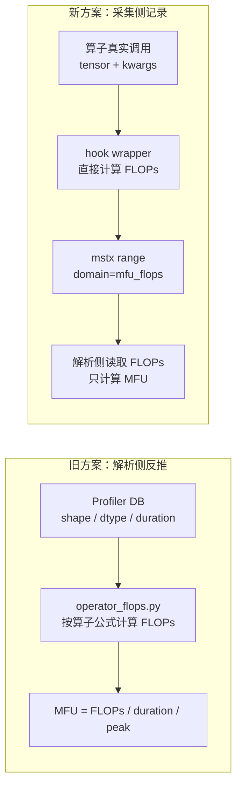
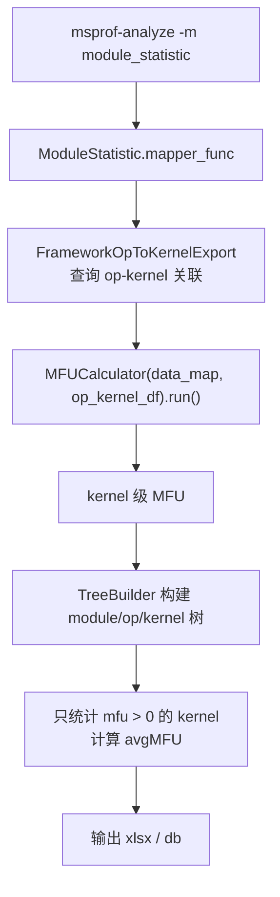
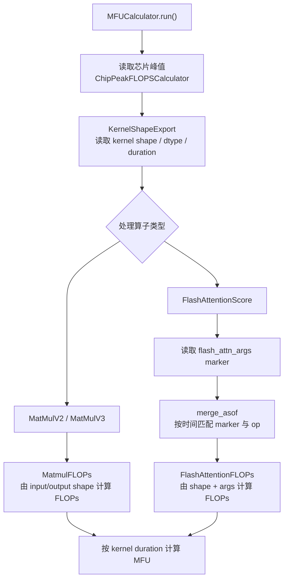
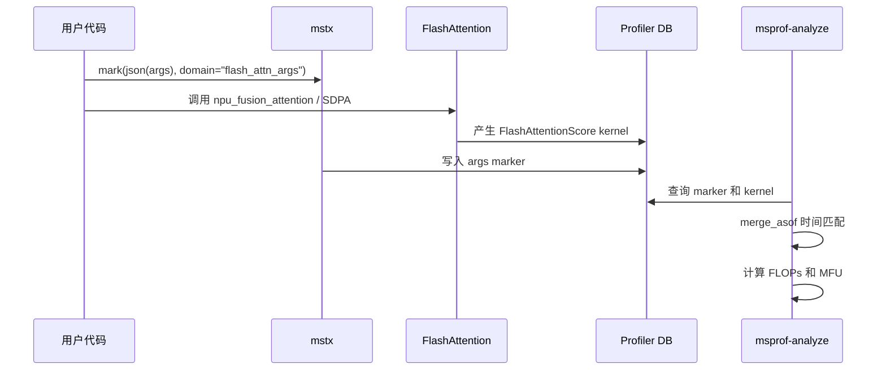
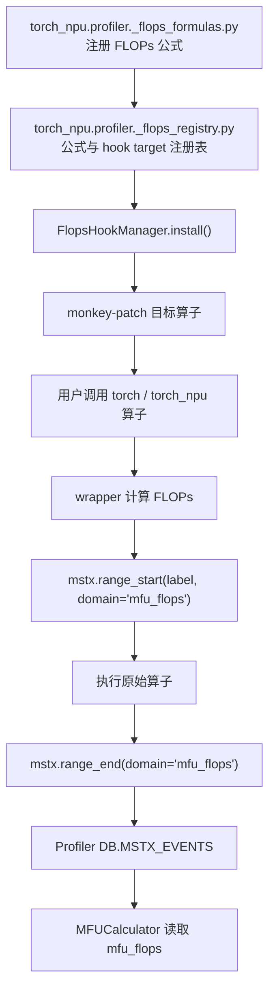
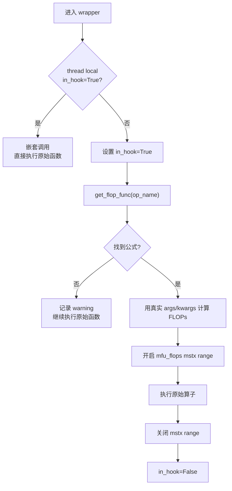
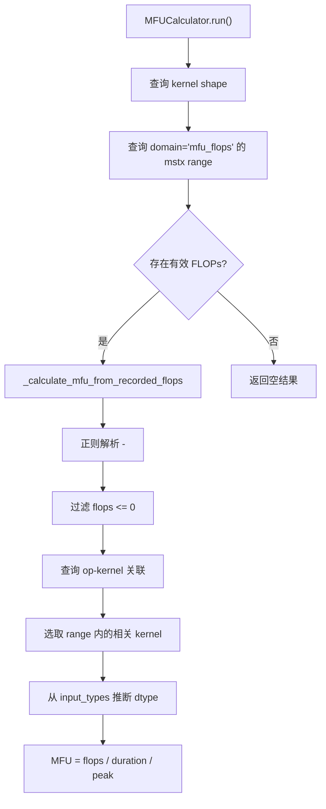
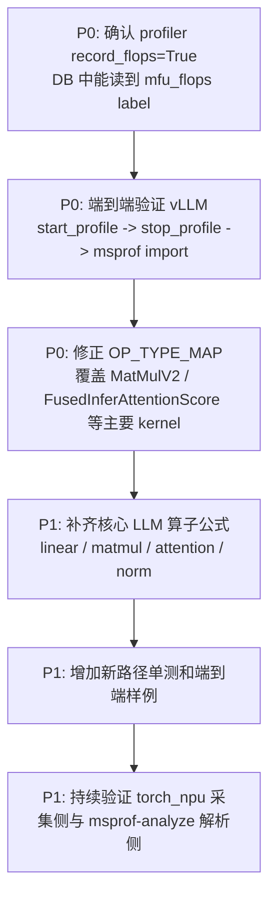

# MFU 采集与计算重构设计文档

## 1. 文档目标

本文用于说明 msprof-analyze 中 MFU（Model FLOPs Utilization）的采集、解析、计算和扩展方式。重点回答四个问题：

1. 旧方案如何从 Profiler DB 反推 FLOPs 并计算 MFU。
2. 重构后如何在算子执行时直接采集 FLOPs。
3. MFU 计算需要哪些数据、这些数据来自哪里。
4. 后续新增算子时应改哪些位置、如何验证。

本文整合了以下材料：

- `operator_mfu/mfu_logic.md`
- `operator_mfu/mfu_refactor_design.md`
- `docs/MFU交接文档.md`
- `docs/zh/getting_started/vllm_ascend_profiling_guide.md`
- 当前源码中的 `operator_mfu`、`mfu_export`、`module_statistic` 实现

## 2. 一句话结论

旧方案把 FLOPs 计算放在解析侧：先从 DB 读取 kernel shape、dtype、耗时，再按算子公式反推 FLOPs。

重构后把 FLOPs 计算前移到 `torch_npu.profiler` 采集侧：训练或推理进程里通过 hook 拦截目标算子，直接用真实入参计算 FLOPs，并用 `mstx` 写入 `mfu_flops` domain。解析侧只读取这份已记录的 FLOPs；如果没有采到，则返回空结果。



## 3. MFU 的定义

MFU 衡量某个 device kernel 在执行期间使用了多少理论峰值算力：

```text
MFU = FLOPs / (duration_ns * 1e-9) / chip_peak_FLOPS
```

字段含义：

| 字段 | 含义 | 来源 |
|---|---|---|
| `FLOPs` | 本次算子实际工作量 | 采集侧 hook 写入 |
| `duration_ns` | kernel 执行耗时，单位 ns | `TASK.endNs - TASK.startNs` |
| `chip_peak_FLOPS` | 芯片理论峰值算力，单位 FLOPS/s | `device_*/info.json.*` |

芯片峰值计算逻辑：

```text
chip_peak_FLOPS = ai_core_num * aic_frequency_MHz * 1_000_000 * ops_per_cycle
```

当前支持的峰值类型：

| 输入 dtype | 峰值 dtype | `ops_per_cycle` |
|---|---|---|
| `FLOAT` / `FLOAT16` | `FLOAT16` | `16 * 16 * 16 * 2 = 8192` |
| `BF16` / `DT_BF16` | `FLOAT16` | `8192` |
| `INT8` | `INT8` | `16 * 32 * 16 * 2 = 16384` |

## 4. 数据来源

MFU 不是从单个文件直接读出来的，而是由 Profiler 数据、mstx 标记和设备信息组合得到。

| 数据 | 表或文件 | 用途 |
|---|---|---|
| kernel 名称、类型、shape、dtype | `COMPUTE_TASK_INFO` + `STRING_IDS` | 判断算子类型并确定 dtype |
| kernel 起止时间 | `TASK` | 计算 `duration_ns`，和框架层 API 做关联 |
| 框架层 API 与 device kernel 关联 | `PYTORCH_API` + `CONNECTION_IDS` | 找到某个 Python op 对应的 kernel |
| 已记录 FLOPs | `MSTX_EVENTS`，`domain='mfu_flops'` | 解析侧直接读取 FLOPs |
| module 层级范围 | `MSTX_EVENTS`，`domain='Module'` | `module_statistic` 构建 module/op/kernel 树 |
| 芯片信息 | `device_*/info.json.*` | 读取 `ai_core_num` 和 `aic_frequency` |

采集前置条件：

| 条件 | 原因 |
|---|---|
| `export_type=Db` | 解析侧依赖 SQLite DB 表 |
| `profiler_level >= level1` | 需要采集 shape 和 dtype |
| `_ExperimentalConfig(record_flops=True)` | 启用 FLOPs hook，并自动启用 `mfu_flops` 所需的 mstx 数据采集 |
| vLLM 服务启动时设置 `--profiler-config` | 否则 `/start_profile`、`/stop_profile` 不注册 |

## 5. 当前入口链路

`module_statistic` recipe 会触发 MFU 计算，并把结果合并回 module/op/kernel 树：



如果没有任何有效 MFU，`module_statistic` 会删除 `avgMFU` 列，避免输出空列。

## 6. 旧方案：解析侧计算 FLOPs

### 6.1 整体流程



旧方案的核心文件：

| 文件 | 职责 |
|---|---|
| `operator_mfu/mfu_calculator.py` | 调度 MFU 计算，区分 MatMul 和 FlashAttention |
| `operator_mfu/operator_flops.py` | 旧方案 FLOPs 策略类 |
| `operator_mfu/chip_peak_flops.py` | 芯片理论峰值计算 |
| `prof_exports/mfu_export.py` | 查询 kernel shape 和 FlashAttention marker |
| `prof_exports/module_statistic_export.py` | 查询 op-kernel 关联、module mstx range |

### 6.2 MatMul 计算逻辑

MatMul 不需要用户额外打点，因为所需信息都来自 `COMPUTE_TASK_INFO`：

```text
FLOPs = 2 * m * n * k
```

维度解析：

| 格式 | 解析方式 |
|---|---|
| ND | `output_shapes[0] = [m, n]`，`k` 从第一个输入 shape 中取与 `m` 不同的维度 |
| NZ | 把昇腾 4D NZ 排布还原为 2D 后，再按 ND 逻辑解析 |

### 6.3 FlashAttention 计算逻辑

FlashAttention 只靠 kernel shape 不够，因为 FLOPs 还受 layout、稀疏模式、causal、真实序列长度影响。旧方案要求用户在调用前写入 `flash_attn_args` marker。



通用 layout（`BNSD` / `BSND` / `BSH` / `SBH`）的基础公式：

```text
full_attention = 2 * B * N * S_q * S_kv * (D_q + D_kv)
```

稀疏模式处理：

| 条件 | FLOPs |
|---|---|
| `sparse_mode == 0` | `full_attention` |
| `S_q == S_kv` 且 `sparse_mode in [2, 3]` | `full_attention * 0.5` |
| `S_q > S_kv` 且 `sparse_mode == 2` | 按下三角有效区域比例折算 |
| 其他支持分支 | 按 `operator_flops.py` 中的稀疏区域比例折算 |

`TND` layout 需要真实序列长度：

```text
q_lens = diff(actual_seq_qlen)
kv_lens = diff(actual_seq_kvlen)
FLOPs = 2 * N * (D_q + D_kv) * dot(q_lens, kv_lens)
```

### 6.4 旧方案的问题

| 问题 | 影响 |
|---|---|
| FlashAttention 依赖用户手工 marker | 容易漏打、打错、时间匹配失败 |
| FLOPs 公式集中在解析侧 | 新增算子要理解 DB shape 字符串和 parser 分组逻辑 |
| `merge_asof` 时间匹配有容差 | marker 与 op 可能错配或缺失 |
| 解析侧无法看到完整 Python 入参 | 对动态 shape、layout、推理专用 fused op 不友好 |

## 7. 新方案：采集侧记录 FLOPs

### 7.1 总体架构



当前实现中，`label` 格式为：

```text
<flops>-<op_name>
```

解析侧读取 `MSTX_EVENTS` 后按 `^(?P<flops>\d+)-(?P<name>.+)$` 严格解析，保留包含 `-` 的算子名称。

### 7.2 hook 的关键逻辑



为什么要有 `in_hook`：

- 一些高层算子内部会调用其他已 hook 的低层算子。
- 如果不做保护，外层和内层会重复记录 FLOPs。
- 当前使用 `threading.local()`，避免多线程之间互相影响。

### 7.3 新解析路径



注意：当前新路径仍会用 `OP_TYPE_MAP` 过滤 kernel type。新增算子时，如果它落库后的 `opType` 不在 `OP_TYPE_MAP` 中，即使采集侧记录了 `mfu_flops`，解析侧也可能过滤掉对应 kernel。

### 7.4 当前已注册的采集侧公式

| Python target | 公式函数 | 说明 |
|---|---|---|
| `torch_npu:npu_fusion_attention` | `npu_fusion_attention_flops` | 训练/通用 FlashAttention |
| `torch_npu:npu_fused_infer_attention_score` | `npu_fused_infer_attention_score_flops` | 推理场景 fused attention，支持 GQA |
| `torch:mm` | `mm_flops` | 2D MatMul |
| `torch:bmm` | `bmm_flops` | batch MatMul |
| `torch:matmul` | `matmul_flops` | 1D/2D/3D/批量矩阵乘 |
| `torch.nn.functional:linear` | `linear_flops` | LLM 推理中主要线性层 |
| `torch:addmm` | `addmm_flops` | addmm 中矩阵乘部分 |

## 8. 旧方案和新方案对比

| 维度 | 旧方案 | 新方案 |
|---|---|---|
| FLOPs 来源 | 解析侧从 shape/dtype/args 反推 | 采集侧用真实入参直接计算 |
| 用户负担 | FlashAttention 需要手动 `flash_attn_args` marker | 统一设置 `_ExperimentalConfig(record_flops=True)` |
| 解析复杂度 | 需要维护 DB shape parser、额外 args、时间匹配 | 主要读取 `mfu_flops` 并计算 MFU |
| 新增算子成本 | parser、策略类、marker、DB 对齐都可能要改 | 注册公式和 hook target，必要时补 kernel type 映射 |
| 准确性风险 | marker 与 op 时间错配；参数缺失 | mstx label/domain 未采集；range 内多 kernel 归因 |
| 兼容性 | 已支持 MatMulV2/MatMulV3/FlashAttentionScore | 不迁入历史数据，不保留 legacy fallback |
| 当前状态 | 已移除 | 代码已迁移到 `torch_npu.profiler`，仍需真实 profiler 环境验证 |

## 9. 部分算子 FLOPs 逻辑

### 9.1 MatMul / mm

```text
输入: A[m, k], B[k, n]
FLOPs = 2 * m * n * k
```

乘法和加法各记一次，所以乘加按 2 FLOPs 计算。

### 9.2 bmm

```text
输入: A[b, m, k], B[b, k, n]
FLOPs = 2 * b * m * n * k
```

### 9.3 matmul

当前采集侧按维度分支：

| 输入维度 | FLOPs |
|---|---|
| 1D x 1D | `2 * len` |
| 2D x 2D | `2 * m * n * k` |
| 3D x 3D | `2 * b * m * n * k` |
| 更高维 | 批量维度相乘后，按批量 MatMul 计算 |

### 9.4 linear

```text
输入: input[..., k], weight[n, k]
FLOPs = 2 * batch_size * n * k
```

其中 `batch_size` 是 `input` 除最后一维外所有维度的乘积。

### 9.5 FlashAttention 通用公式

```text
full_attention = 2 * B * N * S_q * S_kv * (D_q + D_kv)
```

`D_q` 对应 QK 矩阵乘，`D_kv` 对应 AV 矩阵乘。稀疏模式会按有效 attention 区域折算。

### 9.6 FusedInferAttentionScore GQA 公式

推理场景可能是 GQA/MQA，Q 头数和 KV 头数不一致：

```text
FLOPs = 2 * B * num_heads * attention_scores * (D_q + D_kv)
```

TND layout 下使用真实序列长度：

```text
FLOPs = 2 * num_heads * (D_q + D_kv) * dot(q_lens, kv_lens)
```

## 10. 后续如何扩展

### 10.1 新增采集侧算子公式

新增一个算子时，先确认 Python 调用入口，然后在 `torch_npu/profiler/_flops_formulas.py` 注册公式：

```python
from torch_npu.profiler._flops_registry import register_npu_flop


@register_npu_flop(target="torch_npu:some_op")
def some_op_flops(input_tensor, weight, *, some_arg=0, **kwargs):
    # 只使用真实 tensor shape 和 kwargs 计算 FLOPs，不访问 Profiler DB。
    return calculated_flops
```

需要同时检查三件事：

1. target 能否被 `_resolve_target()` import 到。
2. 算子是否会被高层函数提前保存引用；如有，依赖 `_find_existing_refs()` 替换已有引用。
3. 落库后的 kernel `opType` 是否在 `OP_TYPE_MAP` 中；如果不在，需要补映射。

### 10.2 扩展解析侧支持

解析侧不再保留 legacy FLOPs 反推路径。新增算子只需要确认落库后的 kernel `opType` 能被现有映射识别；没有 `mfu_flops` 的历史数据不迁入新链路。

### 10.3 推荐测试清单

| 层级 | 测试点 |
|---|---|
| 公式单测 | 给定 tensor shape 和 kwargs，FLOPs 数值与手算一致 |
| hook 单测 | install/uninstall 后原函数可恢复，嵌套调用不重复记录 |
| DB 查询单测 | `MfuFlopsExport` 能读到 `startNs/endNs/flops` |
| 解析单测 | 有 `mfu_flops` 时解析严格格式；无数据时返回空结果 |
| 端到端 | vLLM profiling 后 DB 中存在 `domain='mfu_flops'` 且 `module_statistic` 输出 `avgMFU` |

## 11. 当前风险和待处理项

| 风险 | 说明 | 建议 |
|---|---|---|
| mstx label/domain 未采集 | FLOPs 依赖 `mfu_flops` range 落库 | vLLM/torch_npu profiler 创建时显式设置 `_ExperimentalConfig(record_flops=True)`，必要时配置 domain include |
| 新路径按 range 匹配 kernel | 如果一个 range 内包含多个 kernel，当前实现会对每个 kernel 使用同一个 FLOPs 值 | 明确每个 range 的语义，必要时按 kernel duration 或 op-kernel 关系做分摊 |
| `OP_TYPE_MAP` 仍是解析侧过滤门槛 | 采集侧支持了更多 Python target，但解析侧只保留映射内 kernel | 新增算子时同步维护 kernel `opType` 映射 |

## 12. 推荐落地路径



优先级判断：

1. 先解决 mstx label/domain 采集，否则新路径没有主数据源。
2. 再补解析侧 kernel type 映射，否则 hook 采到的 FLOPs 可能被过滤。
3. 最后扩充算子公式和优化归因策略。
