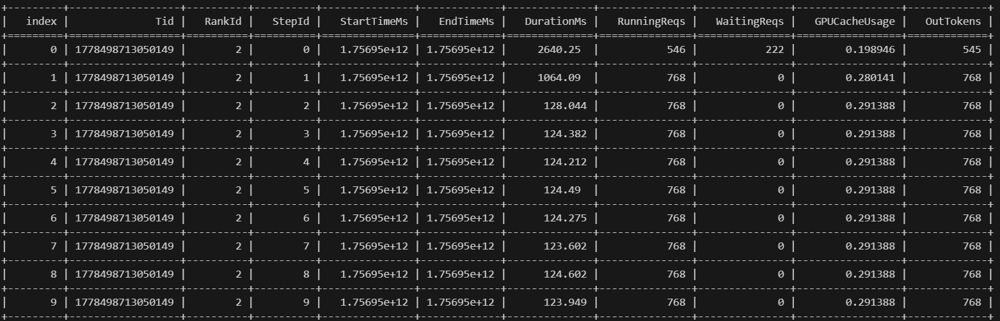
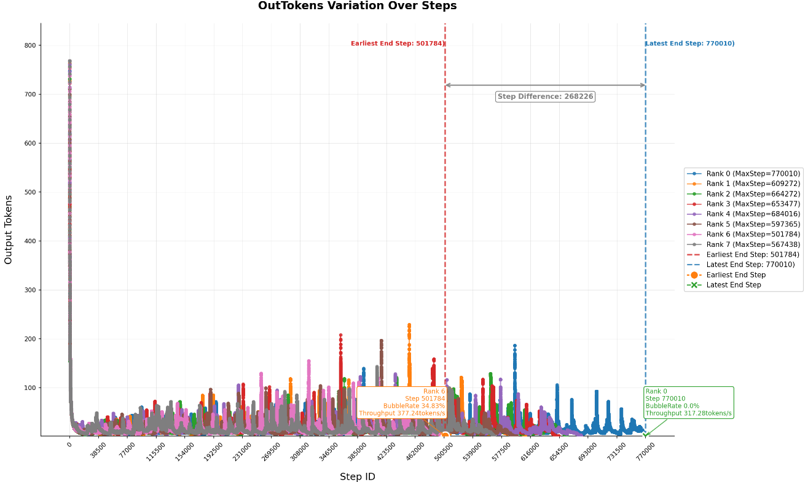
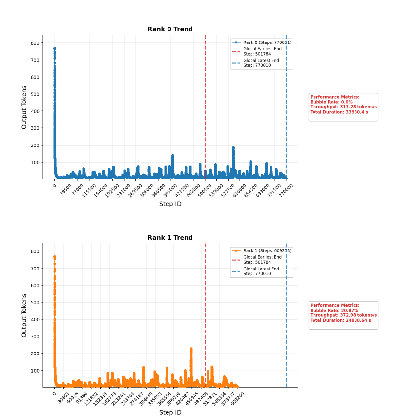

# dp负载可视化数据采集与分析使用说明

## 概述

dp负载可视化分析能力旨在解决vllm推理引擎离线调用以及推理长度不断增加的场景下，DP域间负载情况的可视化观察问题。该分析能力提供：

- 数据采集：基于现有mstx打点功能，在每个dp域上推理引擎的每个step中进行打点，包括每个step开始结束的时间戳以及step的并发数信息
- 性能分析：统计每个DP域空等比例以及吞吐速率，并通过并发量折线图直观反映DP域间负载不均衡现象


## 操作指导

### profiling数据采集

#### 采集配置

考虑到长序列场景下，直接采集profiling占内存较大，因此需要在`torch_npu.profiler._ExperimentalConfig`中进行以下配置：

```
export_type=db #设置导出数据类型为数据库
profiler_level = torch_npu.profiler.ProfilerLevel.Level_none
msprof_tx=True #开启mstx打点开关
mstx_domain_exclude=['communication'] #排除通信信息
```

同时，`torch_npu.profiler.profile`中设置`activities=[torch_npu.profiler.ProfilerActivity.NPU]`

#### 通过装饰器进行打点

1. 打点位置：设置在推理引擎的step方法：`vllm/vllm/v1/engine/core.py`中`EngineCore`类`step`方法处加上装饰器`@step_wrapper`

2. 打点装饰器（参考代码）：

   ```
   import json
   import torch_npu
   from functools import wraps
   
   def step_wrapper(func):
           @wraps(func)
           def wrapper(self, *args, **kwargs):
               step_id = torch_npu.npu.mstx.range_start("step", torch_npu.npu.current_stream(), domain="step_process")
               outputs = func(self, *args, *kwargs)
               out_msg = {
                   "running_reqs":0,
                   "waiting_reqs":0,
                   "gpu_cache_usage":0.0,
                   "out_tokens":0
                   }
               if outputs:
                   out_tokens = len(outputs[0].get(0).outputs)
                   running_reqs = outputs[0].get(0).scheduler_stats.num_running_reqs
                   waiting_reqs = outputs[0].get(0).scheduler_stats.num_waiting_reqs
                   gpu_cache_usage = outputs[0].get(0).scheduler_stats.gpu_cache_usage
                   out_msg.update({
                       "running_reqs":running_reqs,
                       "waiting_reqs":waiting_reqs,
                       "gpu_cache_usage":gpu_cache_usage,
                       "out_tokens":out_tokens
                   })
               torch_npu.npu.mstx.mark(json.dumps(out_msg), torch_npu.npu.current_stream(), domain="step_process")
               if step_id is not None:
                   torch_npu.npu.mstx.range_end(step_id, domain="step_process")
                   step_id = None
               return outputs
           return wrapper
   ```


### msprof-analyze工具分析

#### 命令行使能

```
msprof-analyze cluster -m dp_analysis -d ./your_profiling_path -o ./your_save_path --export_type db
```

##### 参数说明

| 参数          | 说明                        |
| ------------- | :-------------------------- |
| -m            | 分析能力名称                |
| -d            | 集群profiling数据路径       |
| -o            | 输出目录                    |
| --export_type | 输出格式（db， 数据库类型） |

##### 输出文件

| 文件名                | 说明                       |
| --------------------- | -------------------------- |
| cluster_analysis.db   | mstx打点数据db文件         |
| dp_event_summary.csv  | mstx打点数据csv文件        |
| dp_event_plots.png    | 所有DP域并发量变化趋势图   |
| dp_event_subplots.png | 每个DP域并发量变化趋势子图 |


### 样例结果展示

1. 数据库样例展示：

   

   **字段说明**：

   | 字段          | 说明                          |
   | ------------- | ----------------------------- |
   | Tid           | 进程标识                      |
   | RankId        | NPU标识                       |
   | StepId        | 推理步数标识                  |
   | StartTimeMs   | step开始时间戳，单位为ms      |
   | EndTimeMs     | step结束时间戳，单位为ms      |
   | DurationMs    | step持续时长                  |
   | RunningReqs   | 在调度器running队列中的请求数 |
   | WaitingReqs   | 在调度器waiting队列中的请求数 |
   | GPUCacheUsage | 当前GPU/NPU cache利用率       |
   | OutTokens     | step生成token数量             |

1. 可视化样例展示：

   

子图效果（这里仅展示部分子图）：



**指标说明**：这里定义了两个性能指标方便定量定义负载不均衡情况

- 空泡率（bubble_rate）表示当前实例空等比例，数值越高表示空等时间越长
- 吞吐量（throughput）表示模型在整个推理阶段每秒平均输出token数量，数值越高表示处理速度越快

```
bubble_rate = (global_max_step - rank_max_step) / global_max_step * 100%
throughput = total_out_tokens / total_duration_seconds
```