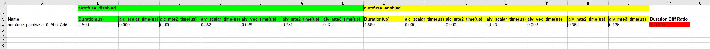

# Operator Performance Comparison Before and After GE Automatic Fusion

## Overview

This feature compares operator performance before and after enabling automatic fusion.

## Preparations

**Constraints**

Only the TensorFlow framework is supported.

**Environment Setup**

- **Hardware**: For hardware environment requirements, see [Ascend Product Models](https://www.hiascend.com/document/detail/en/AscendFAQ/ProduTech/productform/hardwaredesc_0001.html).

- **Software**: Install the matching CANN Toolkit and ops packages, and then configure CANN environment variables. For details, see [CANN Quick Installation Guide](https://www.hiascend.com/en/cann/download).

- **PyTorch & torch_npu**: The `torch_npu` version must be 7.2.0 or later. Supported PyTorch versions are v2.6.0 and v2.7.1. For installation details, see "Installing Pytorch > [Method 1: Binary Package Installation](https://gitcode.com/Ascend/pytorch/blob/v2.7.1-26.0.0/docs/en/installation_guide/installation_via_binary_package.md)" in [Ascend Extension for PyTorch](https://gitcode.com/Ascend/pytorch/blob/v2.7.1-26.0.0/docs/en/installation_guide/installation_description.md).

- Run the build script:

    ```shell
    git clone https://gitcode.com/Ascend/msprof-analyze
    cd msprof-analyze
    # Install dependencies
    pip install -r requirements.txt
    # Build the .so file for graph execution
    cd misc/autofuse_performance_comparison
    bash build.sh
    ```

  After the script is successfully executed, the `ExecuteGraph_C.so` file is generated in the `autofuse_performance_comparison/lib64` directory.

**Data Preparation**

1. Enable automatic fusion.

    ```shell
    export AUTOFUSE_FLAGS="--enable_autofuse=true"
    ```

    For details, see [AutoFuse Enabling Method](https://www.hiascend.com/document/detail/en/canncommercial/850/graph/autofuse/autofuse_1_0004.html).

2. Run the TensorFlow model with both data dump and automatic fusion enabled to obtain the dump data and computational graph files whose names end with `_Build.txt`.

    1. To enable data dump, see [Preparing NPU-side Dump Data and Computational Graph Files](https://www.hiascend.com/document/detail/en/canncommercial/850/devaids/modelaccuracy/atlasaccuracy_16_0007.html).

    2. To enable graph dump, set the following environment variables:

        ```bash
        export PRINT_MODEL=1
        export DUMP_GE_GRAPH=1
        export DUMP_GRAPH_LEVEL=1
        export DUMP_GRAPH_PATH=<dump_path>
        ```

        For details about these environment variables, see [Environment Variable List](https://www.hiascend.com/document/detail/en/canncommercial/850/maintenref/envvar/envref_07_0001.html).

3. Process the data.

   1. Convert the dump data files into .npy files to obtain the inputs and outputs of the fused operators. For details, see section [Converting Dump File Formats](https://www.hiascend.com/document/detail/en/canncommercial/850/devaids/ModelAccuracyAnalyzer/atlasaccuracy_16_0054.html).

      For example, converting `AscBackend.autofuse_pointwise_0_Abs_Add.1.59.1767681027598365` generates the following .npy files: `AscBackend.autofuse_pointwise_0_Abs_Add.1.59.1767681027598365.input.0.npy`, `AscBackend.autofuse_pointwise_0_Abs_Add.1.59.1767681027598365.input.1.npy`, and `AscBackend.autofuse_pointwise_0_Abs_Add.1.59.1767681027598365.output.0.npy`.

   2. Convert the graph files (such as `ge_proto_00000094_graph_1_Build.txt`) into JSON format.

       ```bash
       # The CANN environment variables need to be sourced.
       atc --mode=5 --om=<graph_txt_file_path> --json=<graph_json_file_path>
       ```

## Operator Performance Comparison Before and After GE Automatic Fusion

**Function**

Compares operator performance before and after enabling automatic fusion. This feature is implemented using the `autofuse_performance_comparison.py` script, which is located in the `msprof-analyze/misc/autofuse_performance_comparison/autofuse_core` directory.

**Precautions**

None

**Syntax**

```bash
python3 autofuse_performance_comparison.py -f <whole_graph> -d <subgraph_dir> -p <dump_path> [-o <output_path>]
```

**Command-line Options**

| Option| Mandatory (Yes/No)| Description|
| ----- |-------| ----- |
| -f<br>--whole_graph  | Yes   | Graph file in JSON format, such as `ge_proto_00000094_graph_1_Build.json`.|
| -d<br>--subgraph_dir | Yes   | Directory storing all subgraph files in .txt format (such as `autofuse_pointwise_0_Abs_Add.txt`).|
| -p<br>--dump_path   | Yes   | Directory storing the .npy dump data of all fused operators.|
| -o<br>--output_path | No   | Two subdirectories, `autofuse_enabled` and `autofuse_disabled`, are generated under this path to store the performance data collected when the automatic fusion feature is enabled or disabled, respectively. It defaults to the current directory. In most cases, you do not need to examine this raw data. Simply refer to the [output results](#output-file-description).|

**Example**

After the preparations are complete, run the following commands:

```bash
cd misc/autofuse_performance_comparison/autofuse_core
python3 autofuse_performance_comparison.py -f /data/graph_path/ge_proto_00000094_graph_1_Build.json -d /data/graph_path -p /data/dump_path
```

**Output Description**

After the `autofuse_performance_comparison.py` script finishes execution, an `autofuse_performance_comparison_result_{timestamp}.xlsx` file is generated in the path specified by the `-o` option. For details about the file, see [Output File Description](#output-file-description).

## Output File Description

The output results of GE automatic fusion performance comparison are presented in the `autofuse_performance_comparison_result_{timestamp}.xlsx` file. The following figure shows the data content.



**Fields**

| Field       | Description                           |
| --------- |-------------------------------|
| Name | Name of the fused operator|
| autofuse_disabled, autofuse_enabled| Indicates whether automatic fusion is enabled|
| Duration(us) | Execution duration of the fused operator (μs)|
| Duration Diff Ratio | Ratio of the execution duration of the fused operator to the total execution duration of the original operators, in percentage|

For details about other table columns, see the field descriptions when `aic_metrics` is set to `PipeUtilization` in the [op_summary](https://gitcode.com/Ascend/msprof/blob/26.0.0/docs/en/user_guide/profile_data_file_references.md#op_summary-operator-details).

**Output Analysis**

Performance is considered improved if the fused operator duration is less than 100% of the total execution duration of the original operators. Otherwise, it is considered to have degraded.
