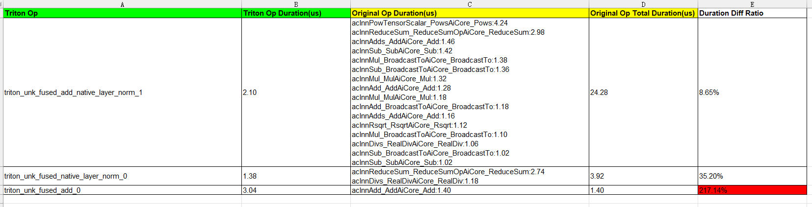

# Operator Performance Comparison Before and After Inductor + Triton Fusion

## Overview

This comparison evaluates the performance of automatically generated fused operators from the Inductor + Triton framework before and after fusion.

## Preparations

**Constraints**

Only the PyTorch framework is supported.

**Environment Setup**

- **Hardware**: For hardware environment requirements, see [Ascend Product Models](https://www.hiascend.com/document/detail/en/AscendFAQ/ProduTech/productform/hardwaredesc_0001.html).

- **Software**: Install the matching CANN Toolkit and ops packages, and then configure CANN environment variables. For details, see [CANN Quick Installation Guide](https://www.hiascend.com/en/cann/download).

- **PyTorch & torch_npu**: The `torch_npu` version must be 7.2.0 or later. Supported PyTorch versions are v2.6.0 and v2.7.1. For installation details, see "Installing Pytorch > [Method 1: Binary Package Installation](https://gitcode.com/Ascend/pytorch/blob/v2.7.1-26.0.0/docs/en/installation_guide/installation_via_binary_package.md)" in [Ascend Extension for PyTorch](https://gitcode.com/Ascend/pytorch/blob/v2.7.1-26.0.0/docs/en/installation_guide/installation_description.md).

- Clone the code repository.

    ```shell
    git clone https://gitcode.com/Ascend/msprof-analyze -b 26.0.0
    ```

- Install dependencies.

    ```bash
    cd msprof-analyze
    pip install -r requirements.txt
    ```

**Data Preparation**

1. Prepare a script or model that uses Inductor-based compilation.

    ```python
    import torch
      
    def add(a, b):
        return a + b
    inductor_add = torch.compile(add)
    ```

   The preceding code sample defines a function named `add` and compiles it using `torch.compile`. The default backend is Inductor.

2. Configure environment variables to dump the FX graphs, which serve as inputs for performance comparison.

    ```shell
    export TORCHINDUCTOR_FX_GRAPH_CACHE=0  # Disable the FX graph cache
    export INDUCTOR_ASCEND_DUMP_FX_GRAPH=1  # Enable FX graph dumping
    export INDUCTOR_ASCEND_FX_GRAPH_CACHE=<dump_path>  # Set the FX graph dump path
    ```

3. Run the user program.

    After the program finishes execution, the FX graph is saved in the directory specified by `INDUCTOR_ASCEND_FX_GRAPH_CACHE`.

## Operator Performance Comparison Before and After Inductor + Triton Fusion

**Function**

Compares the performance of fused operators automatically generated by the Inductor + Triton framework before and after fusion. This feature is implemented using the `inductor_triton_performance_comparison.py` script, which is located in the `msprof-analyze/misc/inductor_triton_performance_comparison` directory.

**Precautions**

None

**Syntax**

```shell
python3 inductor_triton_performance_comparison.py -d <fx_graph_path> [-o <output_path>]
```

**Command-line Options**

| Option| Mandatory (Yes/No)| Description|
| ----- | ----- | ----- |
| -d<br>--fx_graph_path | Yes| Path to the dumped FX graphs.|
| -o<br>--output_path  | No| A subdirectory named `inductor_triton` is created under the specified path to store the collected performance data. The default location is the current directory. In most cases, you do not need to examine this raw data. Simply refer to the [output results](#output-file-description).|

**Example**

After the preparations are complete, run the following commands:

```shell
cd misc/inductor_triton_performance_comparison
python3 inductor_triton_performance_comparison.py -d /data/fx_dump
```

**Output Description**

After the `inductor_triton_performance_comparison.py` script finishes execution, an `inductor_triton_performance_comparison_result_{timestamp}.xlsx` file is generated in the path specified by the `-o` option. For details about the file, see [Output File Description](#output-file-description).

## Output File Description

The output results of performance comparison are presented in the `inductor_triton_performance_comparison_result_{timestamp}.xlsx` file. The following figure shows the data content.



**Table Fields**

| Field       | Description                           |
| --------- |-------------------------------|
| Triton Op | Name of the fused operator automatically generated by the Inductor + Triton framework|
| Triton Op Duration(us) | Execution duration of the fused operator (μs)                   |
| Original Op Duration(us) | Original operators before fusion and their execution durations, sorted in descending order        |
| Original Op Total Duration(us)    | Total execution duration of all original operators (μs)               |
| Duration Diff Ratio | Ratio of the execution duration of the fused operator to the total execution duration of the original operators, in percentage        |

**Output Analysis**

- The file displays the original and fused operators and their execution durations for comparison.
- Performance is considered improved if the fused operator duration is less than 100% of the total execution duration of the original operators. Otherwise, it is considered to have degraded.
